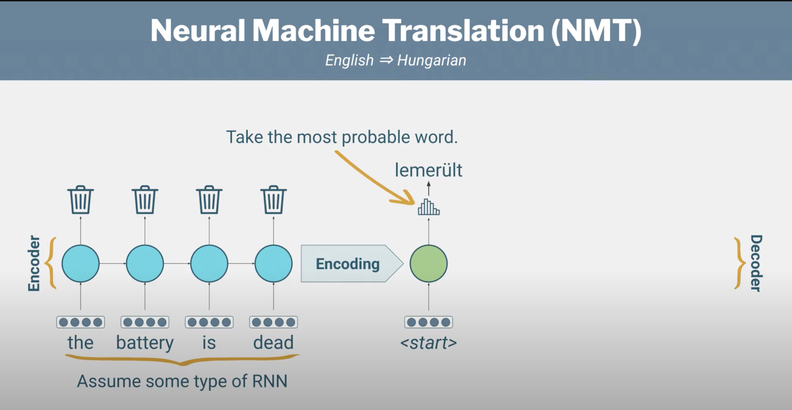

# attention_mechanism
This repo explains "Attention Mechansim" with seq 2 seq Model. 

How to train custom dataset on YOLO V5:

1.git clone YOLOv5 repo (https://github.com/ultralytics/yolov5).

2.download any dataset (I used wheat dataset from kaggle (https://www.kaggle.com/c/global-wheat-detection)).

3.Cut and paste editing.py , wheat.yaml and wheat_data(from yoolo folder) in git cloned yolov5 model. 

4.if dataset is different than make changes in wheat_data accordingly.

5.Place folders according to directories.

6.run using : "pyton train.py --img 1024 --batch 8 --epochs 100 --data wheat.yaml --cfg models/yolov5s.yaml --name wm -- weights."

Note : in my repo, downloaded dataset and yolov5 repo is missing.

Reference Video : https://www.youtube.com/watch?v=NU9Xr_NYslo
